# DelphiBlend2D - Blend2D for Delphi

## Language bindings and framework for Blend2D

[Blend2D](https://blend2d.com/) is high-performance 2D vector graphics engine. The engine utilizes a built-in JIT compiler to generate optimized pipelines at runtime that take the advantage of host CPU features and is capable of using multiple threads to boost the performance beyond the possibilities of single-threaded rendering. Blend2D can render rectangles, simple shapes, geometries composed of lines and Bézier curves, and text. The 2D pipeline supports pixel composition, opacity control, and styles such as solid colors, gradients, and images.

DelphiBlend2D opens up Blend2D for Delphi developers. It can be used stand-alone to render to an off-screen image, or with the VCL or FireMonkey frameworks to render to the screen. The API is easy to use and follows the original C++ API as much as possible.

|  | 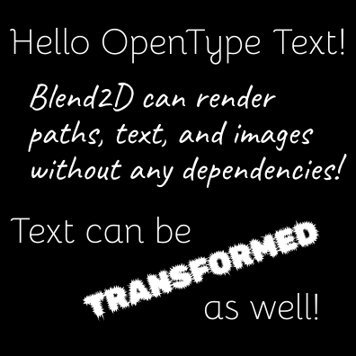 |  |
| -------------------------------- | -------------------------------- | -------------------------------- |

> Note that Blend2D (and thus DelphiBlend2D) is still in beta. The API and framework is subject to change.

DelphiBlend2D currently supports Windows (32- and 64-bit) and macOS (Intel and ARM), iOS (device only, no simulator) and Android (32- and 64-bit).

> The Blend2D libraries that are currently used are not fully optimized yet. Although performance is already excellent, and usually (much) faster than competing libraries like Skia, you expect even better performance once Blend2D goes out of beta.

### High Performance

Designed from scratch to take advantage of JIT pipeline generation to achieve maximum performance. The JIT compiler takes advantage of the host CPU micro-architecture and features. For example, Blend2D avoids gathers on CPUs that are affected by [Downfall](https://en.wikipedia.org/wiki/Downfall_(security_vulnerability)) vulnerability. The JIT compiler can target anything starting from SSE2 up to AVX-512 on X86 and ASIMD on AArch64. See [Performance Comparison](https://blend2d.com/performance.html) for more details.

### Rendering Quality

The quality of the rendered geometry is comparable to other rendering engines that use analytic anti-aliasing. Blend2D uses 8-bit anti-aliasing (256 levels of gray) by default, which is enough to render beautiful vector graphics and text. Blend2D uses the same algorithm that is used by [FreeType](https://en.wikipedia.org/wiki/FreeType) and [AntiGrain Geometry](https://en.wikipedia.org/wiki/Anti-Grain_Geometry), however, it has been optimized to deliver maximum performance without sacrificing the output quality.

### Portability

From an experiment that originally only targeted X86 architecture to a portable library that provides JIT backends for X86 (32-bit or 64-bit) and ARM64 (AArch64) architectures, which is enough to cover server, desktop, and mobile markets. Blend2D also provides a portable pipeline that can be used on hardware without a working JIT acceleration.

## Easy to Use API

The primary goal of the Delphi API is to make the Blend2D library easy-to-use without the need of managing resources manually. The binding uses [Custom Managed Records](https://docwiki.embarcadero.com/RADStudio/Athens/en/Custom_Managed_Records) as lightweight "classes" that automatically manages memory and other resources, while still being very efficient and lightweight.

The DelphiBlend2D OOP framework follows the [Blend2D C++ API](https://blend2d.com/doc/index.html) as closely as possible. It uses interfaces for automatic resource management. The snippet below is taken from the `blGettingStarted05` sample project. 

```Delphi
procedure Run;
begin
  var Image := TBLImage.Create(480, 480, TBLFormat.Prgb32);
  var Context := TBLContext.Create(Image);

  Context.ClearAll;

  { First shape filled with a radial gradient.
    By default, SrcOver composition is used. }
  var Radial := TBLGradient.Create(
    BLRadialGradientValues(180, 180, 180, 180, 180));
  Radial.AddStop(0.0, $FFFFFFFF);
  Radial.AddStop(1.0, $FFFF6F3F);
  Context.FillCircle(180, 180, 160, Radial);

  { Second shape filled by a linear gradient. }
  var Linear := TBLGradient.Create(
    BLLinearGradientValues(195, 195, 470, 470));
  Linear.AddStop(0.0, $FFFFFFFF);
  Linear.AddStop(1.0, $FF3F9FFF);

  { Use CompOp to change a composition operator. }
  Context.CompOp := TBLCompOp.Difference;
  Context.FillRoundRect(195, 195, 270, 270, 25, Linear);

  Context.Finish;

  Image.WriteToFile('blGettingStarted05.png');
end;
```

It creates the following output:

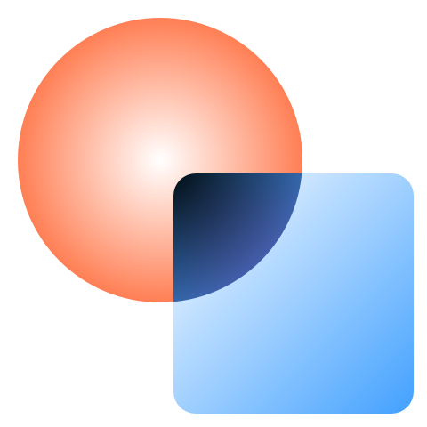

## Gradients & Patterns

Blend2D offers similar paint styles as defined by SVG and HTML `<canvas>` including solid colors, gradients, and patterns. The rendering context uses a separate slots for styling fill and stroke operations to make it possible to have assigned both fill and stroke styles at the same time. It also supports passing colors and styles directly to the rendering API. Blend2D at the moment supports linear, radial, and conic gradients. Extend modes specify whether colors should be padded, repeated, or reflected; and quality modes can be used to turn on gradient dithering to prevent banding.

|  |  |  |
| -------------------------------- | -------------------------------- | -------------------------------- |

### Patterns & Extend Modes

Patterns also support extend modes, which can be configured independently of X and Y, thus supporting 9 combinations total. The images below show a variation of repeat and reflect modes of image used as a pattern.

| 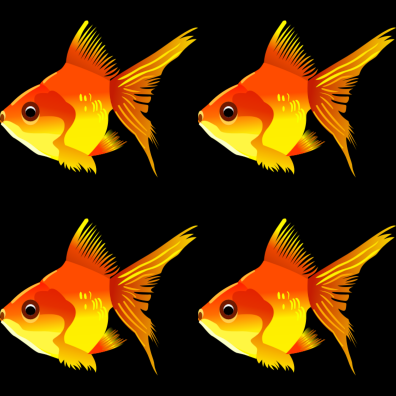 | 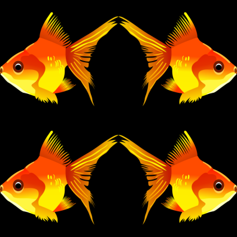 | 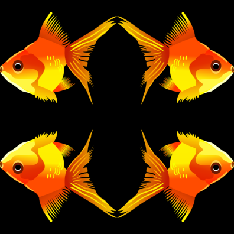 |
| -------------------------------- | -------------------------------- | -------------------------------- |

## Composition & Blending

Blend2D supports all Porter & Duff compositing operators and a wide range of blend modes defined by SVG and HTML `<canvas>`. Composition and blending modes can be applied to any rendering operation including fills, strokes, and image blits. In addition to composition operators, Blend2D provides also an opacity option to control the strength of the composition.

| 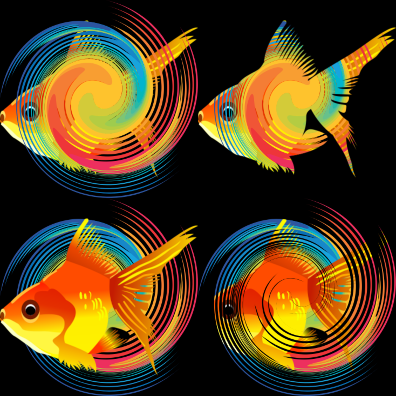 |  | 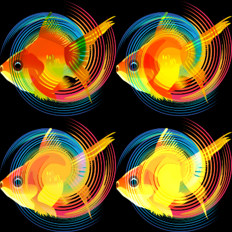 |
| -------------------------------- | -------------------------------- | -------------------------------- |

## Sample Applications

Blend2D quickstart and interactive applications are available in the Samples subdirectory. These samples provide either interactive demonstrations of some Blend2D features like stroking or animated demonstrations that can use the Blend2D, FireMonkey or Skia rendering engine for both performance and quality comparison.

| 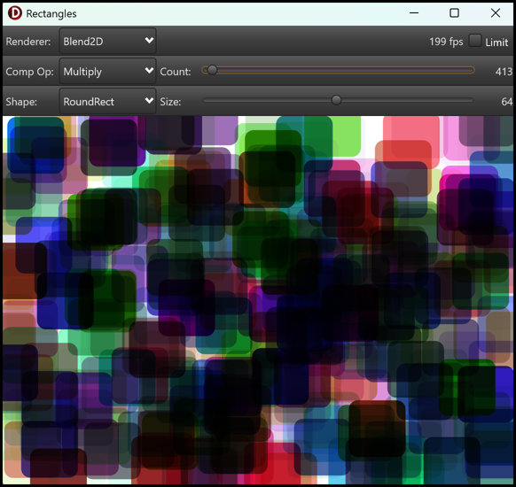 | 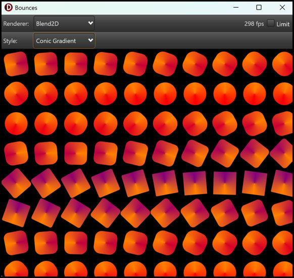 |
| -------------------------------- | -------------------------------- |
| 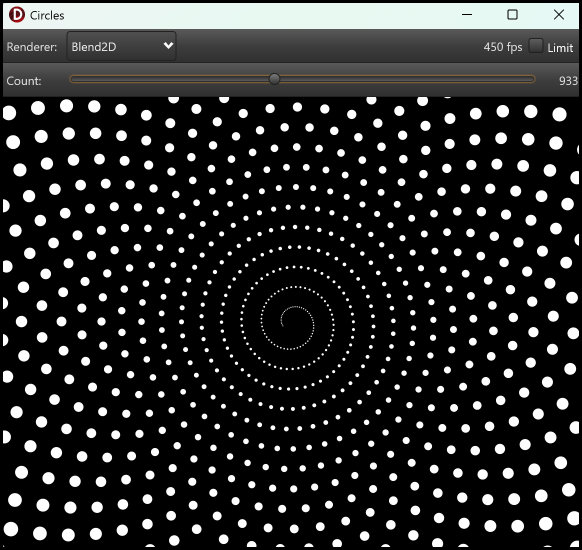 | 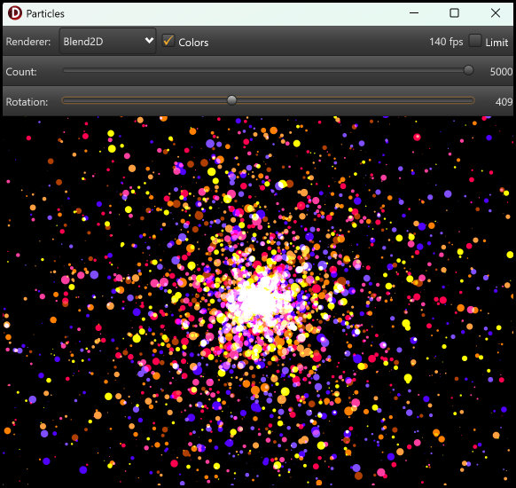 |
| 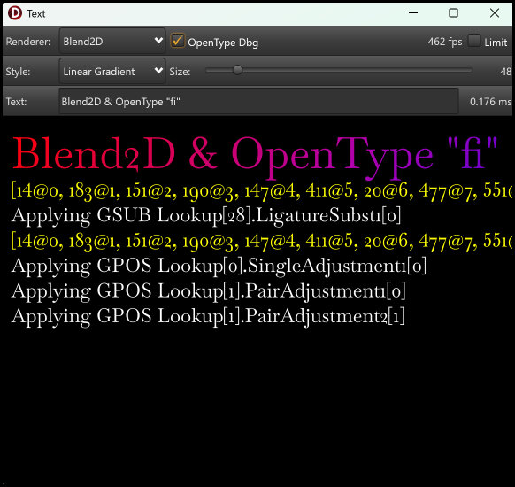 | 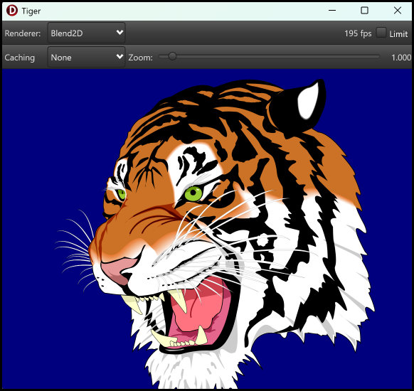 |
| 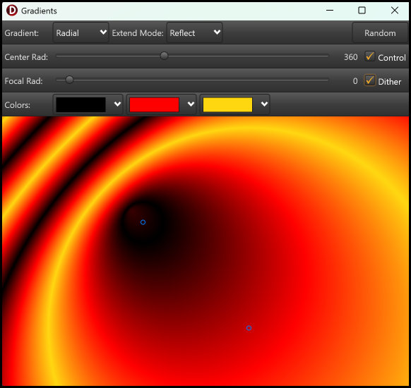 | 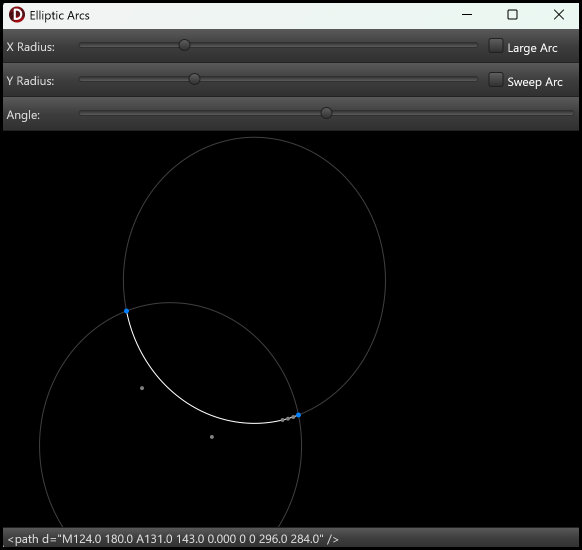 |
| 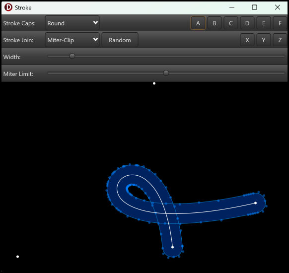 | 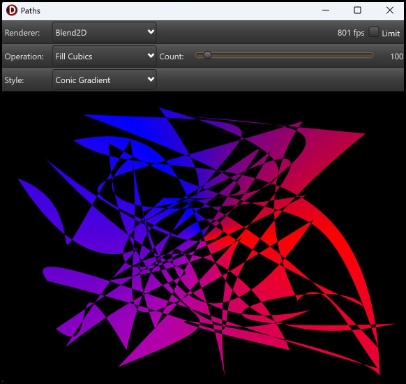 |
| 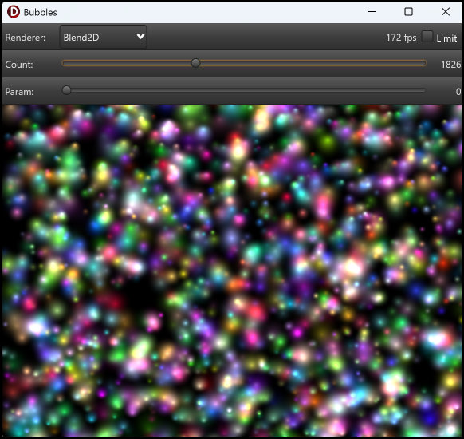 | 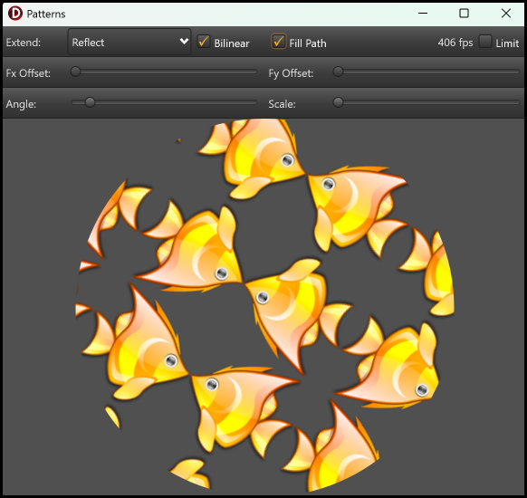 |

## Documentation

DelphiBlend2D is documented on github.io. Use the [Documentation Index](https://neslib.github.io/DelphiBlend2D/) page as a starting point, or the [API Reference](https://neslib.github.io/DelphiBlend2D/Reference/Blend2D/) pages for complete API documentation by. This documentation is extracted from the source code, so you can use the (XML) documentation in the source code as well. Delphi's CodeInsight will also show this documentation when you hover the mouse over an SDL declaration.

Since the framework matches the original C++ API where possible, you can also use the original [Blend2D documentation](https://blend2d.com/doc/index.html).

## Version

Based on Blend2D 0.12.0.

## License

Both Blend2D and DelphiBlend2D are released under the Zlib license. See License.txt for details.

